# ESP-8266 (NodeMCU v2) — How-Tos & Component Testing

> **Board:** NodeMCU v2 (ESP-12E module)
> **Framework:** Arduino (PlatformIO)
> **Monitor baud:** 115200

---

## Table of Contents

1. [NodeMCU v2 Pinout Reference](#nodemcu-v2-pinout-reference)
2. [Blink — Onboard LED](#1-blink--onboard-led)
3. [Digital Output — External LED](#2-digital-output--external-led)
4. [Digital Input — Push Button](#3-digital-input--push-button)
5. [Analog Input — Potentiometer](#4-analog-input--potentiometer)
6. [PWM — LED Dimming](#5-pwm--led-dimming)
7. [Servo Motor Control](#6-servo-motor-control)
8. [DHT11/DHT22 Temperature & Humidity Sensor](#7-dht11dht22-temperature--humidity-sensor)
9. [I²C — OLED Display (SSD1306)](#8-ic--oled-display-ssd1306)
10. [Ultrasonic Distance Sensor (HC-SR04)](#9-ultrasonic-distance-sensor-hc-sr04)
11. [Wi-Fi — Connect to a Network](#10-wi-fi--connect-to-a-network)
12. [Wi-Fi — Simple Web Server](#11-wi-fi--simple-web-server)
13. [Relay Module Control](#12-relay-module-control)
14. [Buzzer — Tone Generation](#13-buzzer--tone-generation)
15. [Glossary](#glossary)

---

## NodeMCU v2 Pinout Reference

| Label on Board | GPIO  | Notes                                 |
| -------------- | ----- | ------------------------------------- |
| D0             | GPIO16| Wake from deep sleep, no PWM/I²C     |
| D1             | GPIO5 | I²C SCL (default)                    |
| D2             | GPIO4 | I²C SDA (default)                    |
| D3             | GPIO0 | FLASH button, pulled HIGH             |
| D4             | GPIO2 | Onboard LED (active LOW), pulled HIGH |
| D5             | GPIO14| SPI SCLK                              |
| D6             | GPIO12| SPI MISO                              |
| D7             | GPIO13| SPI MOSI                              |
| D8             | GPIO15| SPI CS, pulled LOW                    |
| A0             | ADC0  | Analog input 0–1 V (10-bit)          |

> **Important:** The NodeMCU v2 onboard LED on **D4 (GPIO2)** is **active LOW** — writing `LOW` turns it **ON**.

---

## 1. Blink — Onboard LED

The simplest test to verify your board and toolchain work.

### Wiring Diagram

No external wiring needed — uses the onboard LED on D4 (GPIO2).

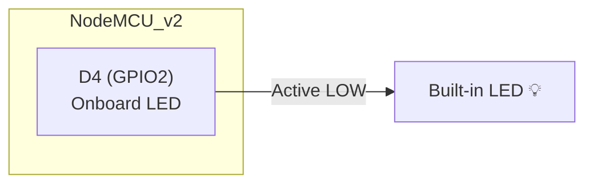

### Code

```cpp
#include <Arduino.h>

#define LED_BUILTIN_ESP 2  // GPIO2 = D4 = onboard LED

void setup() {
  pinMode(LED_BUILTIN_ESP, OUTPUT);
}

void loop() {
  digitalWrite(LED_BUILTIN_ESP, LOW);   // LED ON  (active LOW)
  delay(500);
  digitalWrite(LED_BUILTIN_ESP, HIGH);  // LED OFF
  delay(500);
}
```

---

## 2. Digital Output — External LED

### Wiring Diagram

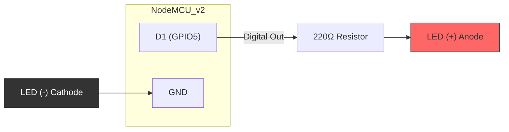

### Connections

| Component   | Pin         | NodeMCU Pin |
| ----------- | ----------- | ----------- |
| LED Anode   | + (long leg)| D1 via 220Ω resistor |
| LED Cathode | - (short leg)| GND        |

### Code

```cpp
#include <Arduino.h>

#define LED_PIN D1  // GPIO5

void setup() {
  pinMode(LED_PIN, OUTPUT);
}

void loop() {
  digitalWrite(LED_PIN, HIGH);
  delay(1000);
  digitalWrite(LED_PIN, LOW);
  delay(1000);
}
```

---

## 3. Digital Input — Push Button

### Wiring Diagram

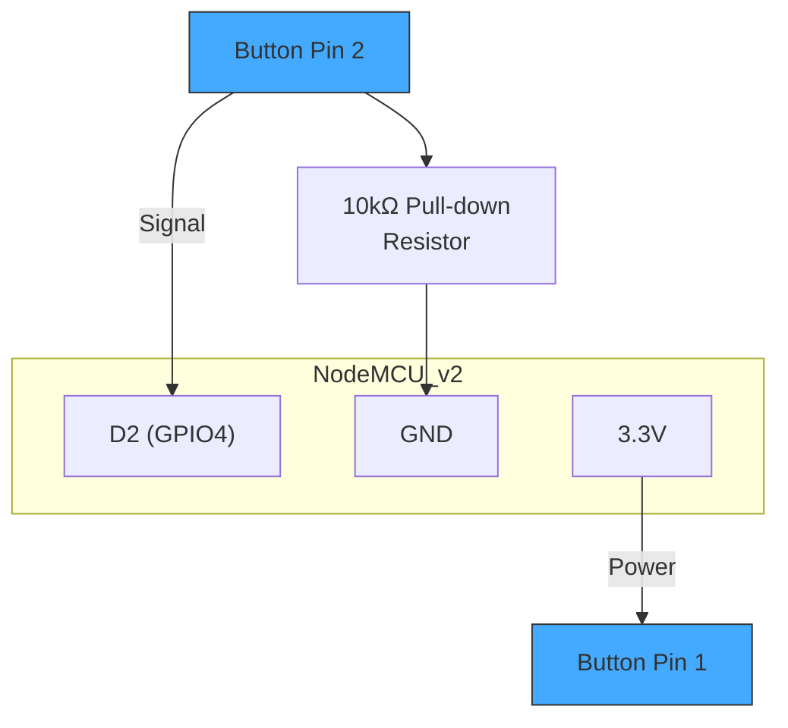

### Connections

| Component          | Connect To     |
| ------------------ | -------------- |
| Button Pin 1       | 3.3V           |
| Button Pin 2       | D2 (GPIO4)     |
| Button Pin 2       | GND via 10kΩ (pull-down) |

### Code

```cpp
#include <Arduino.h>

#define BUTTON_PIN D2   // GPIO4
#define LED_PIN    D1   // GPIO5

void setup() {
  Serial.begin(115200);
  pinMode(BUTTON_PIN, INPUT);
  pinMode(LED_PIN, OUTPUT);
}

void loop() {
  int state = digitalRead(BUTTON_PIN);
  digitalWrite(LED_PIN, state);
  Serial.printf("Button: %s\n", state ? "PRESSED" : "RELEASED");
  delay(100);
}
```

> **Tip:** You can also use `INPUT_PULLUP` and wire the button to GND (no external resistor needed), but the logic will be inverted.

---

## 4. Analog Input — Potentiometer

The NodeMCU v2 has **one** analog pin (A0) with a 0–1V input range (an onboard voltage divider scales 0–3.3V down to 0–1V).

### Wiring Diagram

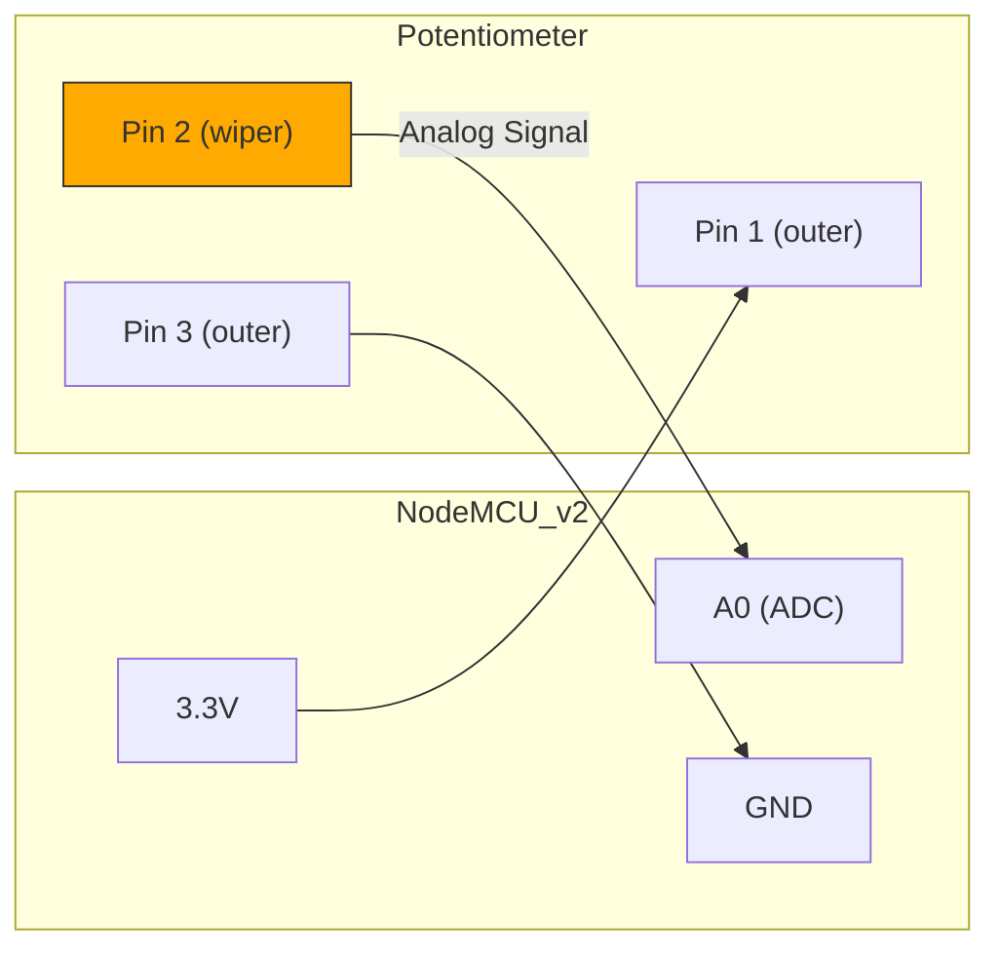

### Connections

| Potentiometer Pin | Connect To |
| ----------------- | ---------- |
| Pin 1 (outer)     | 3.3V       |
| Pin 2 (wiper/middle) | A0     |
| Pin 3 (outer)     | GND        |

### Code

```cpp
#include <Arduino.h>

void setup() {
  Serial.begin(115200);
}

void loop() {
  int value = analogRead(A0);  // 0–1023
  float voltage = value * (3.3 / 1023.0);
  Serial.printf("ADC: %d | Voltage: %.2f V\n", value, voltage);
  delay(250);
}
```

---

## 5. PWM — LED Dimming

All GPIOs on the ESP8266 support software PWM (except GPIO16).

### Wiring Diagram

Same wiring as [External LED](#2-digital-output--external-led).

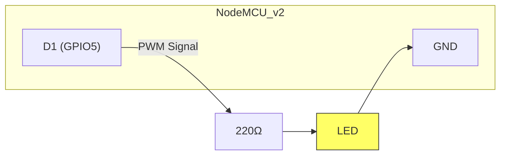

### Code

```cpp
#include <Arduino.h>

#define LED_PIN D1  // GPIO5

void setup() {
  pinMode(LED_PIN, OUTPUT);
  analogWriteRange(1023);  // 10-bit resolution (default)
  analogWriteFreq(1000);   // 1 kHz
}

void loop() {
  // Fade in
  for (int duty = 0; duty <= 1023; duty += 5) {
    analogWrite(LED_PIN, duty);
    delay(5);
  }
  // Fade out
  for (int duty = 1023; duty >= 0; duty -= 5) {
    analogWrite(LED_PIN, duty);
    delay(5);
  }
}
```

---

## 6. Servo Motor Control

### Wiring Diagram

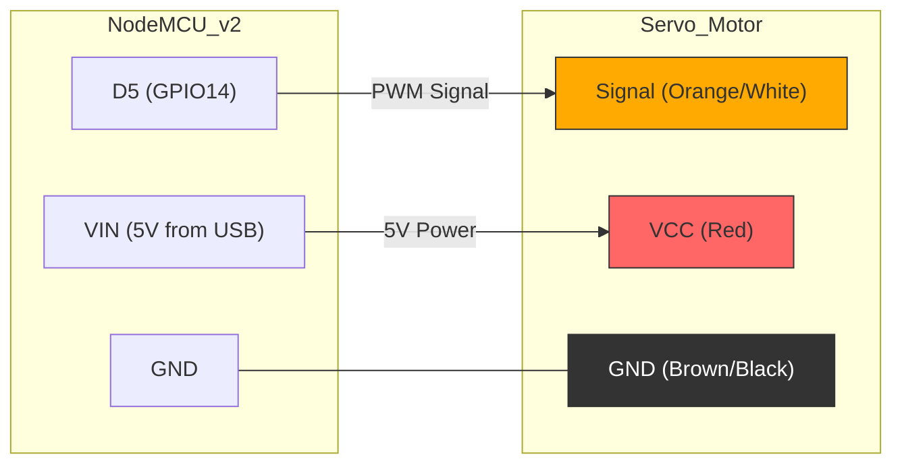

### Connections

| Servo Wire         | Connect To       |
| ------------------- | ---------------- |
| Signal (orange)     | D5 (GPIO14)      |
| VCC (red)           | VIN (5V via USB) |
| GND (brown/black)   | GND              |

> **Note:** For multiple or larger servos, use an **external 5V supply** and share a common GND with the NodeMCU.

### Code

Add to `platformio.ini`:
```ini
lib_deps = 
    servo
```

```cpp
#include <Arduino.h>
#include <Servo.h>

#define SERVO_PIN D5  // GPIO14

Servo myServo;

void setup() {
  myServo.attach(SERVO_PIN);
}

void loop() {
  for (int angle = 0; angle <= 180; angle += 10) {
    myServo.write(angle);
    delay(200);
  }
  for (int angle = 180; angle >= 0; angle -= 10) {
    myServo.write(angle);
    delay(200);
  }
}
```

---

## 7. DHT11/DHT22 Temperature & Humidity Sensor

### Wiring Diagram

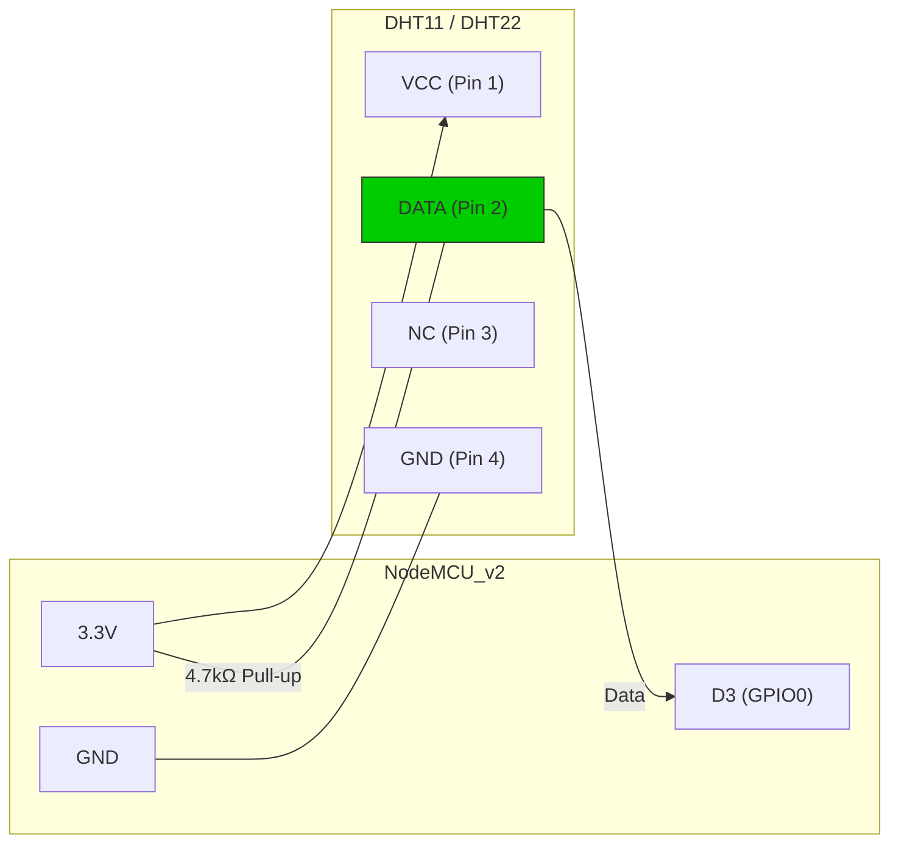

### Connections

| DHT Pin   | Connect To                      |
| --------- | ------------------------------- |
| Pin 1 VCC | 3.3V                            |
| Pin 2 DATA| D3 (GPIO0) + 4.7kΩ pull-up to 3.3V |
| Pin 3 NC  | Not connected                   |
| Pin 4 GND | GND                             |

### Code

Add to `platformio.ini`:
```ini
lib_deps = 
    adafruit/DHT sensor library@^1.4.4
    adafruit/Adafruit Unified Sensor@^1.1.9
```

```cpp
#include <Arduino.h>
#include <DHT.h>

#define DHT_PIN  D3       // GPIO0
#define DHT_TYPE DHT11    // or DHT22

DHT dht(DHT_PIN, DHT_TYPE);

void setup() {
  Serial.begin(115200);
  dht.begin();
}

void loop() {
  float humidity    = dht.readHumidity();
  float tempC       = dht.readTemperature();
  float tempF       = dht.readTemperature(true);

  if (isnan(humidity) || isnan(tempC)) {
    Serial.println("Failed to read from DHT sensor!");
    delay(2000);
    return;
  }

  float heatIndex = dht.computeHeatIndex(tempF, humidity);

  Serial.printf("Humidity: %.1f%%  |  Temp: %.1f°C / %.1f°F  |  Heat Index: %.1f°F\n",
                humidity, tempC, tempF, heatIndex);
  delay(2000);
}
```

---

## 8. I²C — OLED Display (SSD1306)

### Wiring Diagram

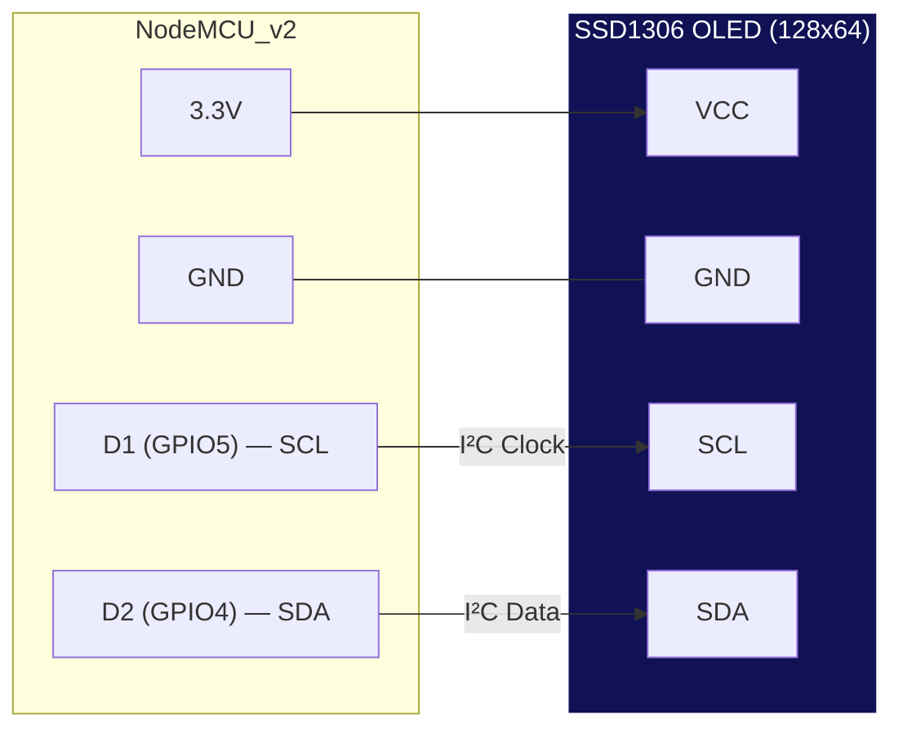

### Connections

| OLED Pin | NodeMCU Pin        |
| -------- | ------------------ |
| VCC      | 3.3V               |
| GND      | GND                |
| SCL      | D1 (GPIO5)         |
| SDA      | D2 (GPIO4)         |

### Code

Add to `platformio.ini`:
```ini
lib_deps = 
    adafruit/Adafruit SSD1306@^2.5.7
    adafruit/Adafruit GFX Library@^1.11.5
```

```cpp
#include <Arduino.h>
#include <Wire.h>
#include <Adafruit_GFX.h>
#include <Adafruit_SSD1306.h>

#define SCREEN_WIDTH  128
#define SCREEN_HEIGHT 64
#define OLED_RESET    -1
#define OLED_ADDR     0x3C

Adafruit_SSD1306 display(SCREEN_WIDTH, SCREEN_HEIGHT, &Wire, OLED_RESET);

void setup() {
  Serial.begin(115200);

  if (!display.begin(SSD1306_SWITCHCAPVCC, OLED_ADDR)) {
    Serial.println("SSD1306 allocation failed!");
    for (;;);
  }

  display.clearDisplay();
  display.setTextSize(1);
  display.setTextColor(SSD1306_WHITE);
  display.setCursor(0, 0);
  display.println("Hello from");
  display.setTextSize(2);
  display.println("NodeMCU!");
  display.display();
}

void loop() {}
```

---

## 9. Ultrasonic Distance Sensor (HC-SR04)

> **Note:** The HC-SR04 operates at 5V. Use VIN (5V from USB) for power and a voltage divider on the Echo pin to bring 5V down to 3.3V for the NodeMCU.

### Wiring Diagram

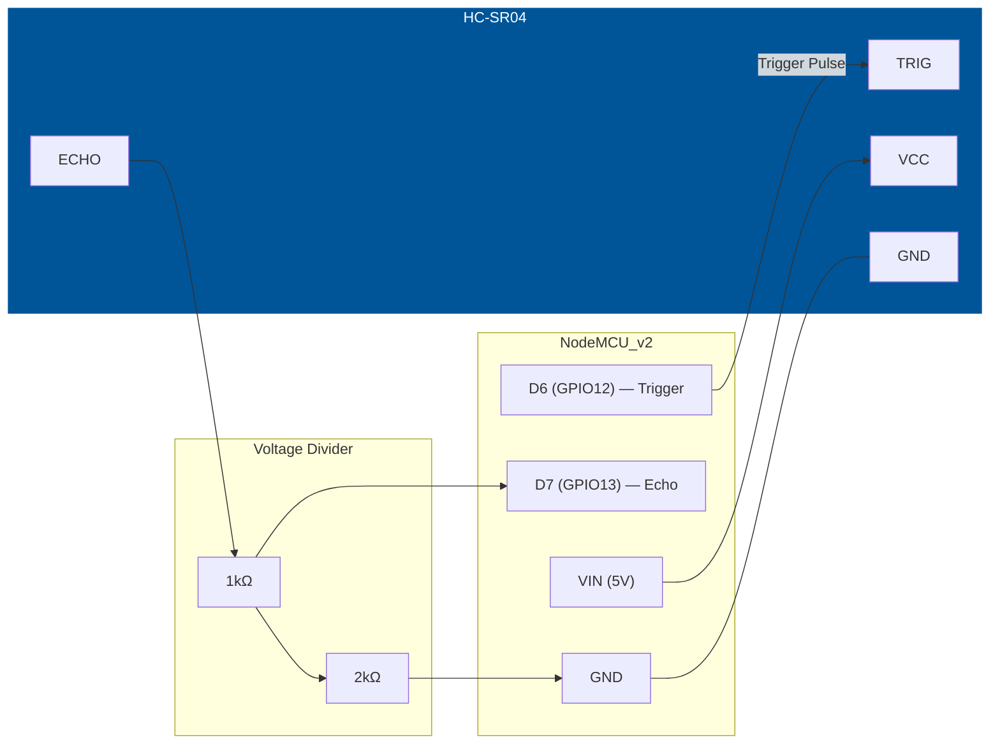

### Connections

| HC-SR04 Pin | Connect To                                  |
| ----------- | ------------------------------------------- |
| VCC         | VIN (5V)                                    |
| TRIG        | D6 (GPIO12)                                 |
| ECHO        | D7 (GPIO13) via voltage divider (1kΩ + 2kΩ) |
| GND         | GND                                         |

### Code

```cpp
#include <Arduino.h>

#define TRIG_PIN D6  // GPIO12
#define ECHO_PIN D7  // GPIO13

void setup() {
  Serial.begin(115200);
  pinMode(TRIG_PIN, OUTPUT);
  pinMode(ECHO_PIN, INPUT);
}

float measureDistance() {
  digitalWrite(TRIG_PIN, LOW);
  delayMicroseconds(2);
  digitalWrite(TRIG_PIN, HIGH);
  delayMicroseconds(10);
  digitalWrite(TRIG_PIN, LOW);

  long duration = pulseIn(ECHO_PIN, HIGH, 30000); // timeout 30ms
  float distance = (duration * 0.0343) / 2.0;     // cm
  return distance;
}

void loop() {
  float dist = measureDistance();
  if (dist > 0) {
    Serial.printf("Distance: %.1f cm\n", dist);
  } else {
    Serial.println("Out of range");
  }
  delay(500);
}
```

---

## 10. Wi-Fi — Connect to a Network

### Code

```cpp
#include <Arduino.h>
#include <ESP8266WiFi.h>

const char* ssid     = "YOUR_SSID";
const char* password = "YOUR_PASSWORD";

void setup() {
  Serial.begin(115200);
  delay(100);

  Serial.printf("\nConnecting to %s", ssid);
  WiFi.mode(WIFI_STA);
  WiFi.begin(ssid, password);

  while (WiFi.status() != WL_CONNECTED) {
    delay(500);
    Serial.print(".");
  }

  Serial.println("\nWi-Fi connected!");
  Serial.printf("IP Address: %s\n", WiFi.localIP().toString().c_str());
  Serial.printf("Signal Strength (RSSI): %d dBm\n", WiFi.RSSI());
  Serial.printf("MAC Address: %s\n", WiFi.macAddress().c_str());
}

void loop() {}
```

---

## 11. Wi-Fi — Simple Web Server

### Code

```cpp
#include <Arduino.h>
#include <ESP8266WiFi.h>
#include <ESP8266WebServer.h>

const char* ssid     = "YOUR_SSID";
const char* password = "YOUR_PASSWORD";

ESP8266WebServer server(80);

#define LED_PIN D1  // GPIO5

void handleRoot() {
  String html = "<!DOCTYPE html><html><head>"
    "<meta name='viewport' content='width=device-width, initial-scale=1'>"
    "<title>NodeMCU Control</title></head><body>"
    "<h1>NodeMCU v2 Web Server</h1>"
    "<p><a href='/led/on'><button>LED ON</button></a></p>"
    "<p><a href='/led/off'><button>LED OFF</button></a></p>"
    "</body></html>";
  server.send(200, "text/html", html);
}

void handleLedOn() {
  digitalWrite(LED_PIN, HIGH);
  server.sendHeader("Location", "/");
  server.send(303);
}

void handleLedOff() {
  digitalWrite(LED_PIN, LOW);
  server.sendHeader("Location", "/");
  server.send(303);
}

void setup() {
  Serial.begin(115200);
  pinMode(LED_PIN, OUTPUT);

  WiFi.mode(WIFI_STA);
  WiFi.begin(ssid, password);
  while (WiFi.status() != WL_CONNECTED) {
    delay(500);
    Serial.print(".");
  }
  Serial.printf("\nServer running at http://%s/\n",
                WiFi.localIP().toString().c_str());

  server.on("/", handleRoot);
  server.on("/led/on", handleLedOn);
  server.on("/led/off", handleLedOff);
  server.begin();
}

void loop() {
  server.handleClient();
}
```

---

## 12. Relay Module Control

### Wiring Diagram

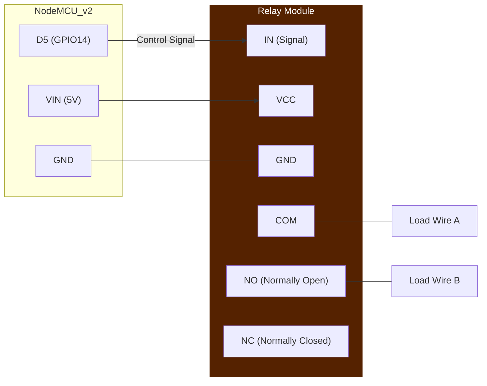

### Connections

| Relay Module Pin | Connect To       |
| ---------------- | ---------------- |
| IN (signal)      | D5 (GPIO14)      |
| VCC              | VIN (5V)         |
| GND              | GND              |
| COM              | Load common      |
| NO               | Load switched    |

> **Safety:** Never handle mains-voltage wiring while the circuit is powered. Use appropriate-rated relays for high-voltage loads.

### Code

```cpp
#include <Arduino.h>

#define RELAY_PIN D5  // GPIO14

void setup() {
  Serial.begin(115200);
  pinMode(RELAY_PIN, OUTPUT);
  digitalWrite(RELAY_PIN, HIGH);  // Most relay modules are active LOW
}

void loop() {
  Serial.println("Relay ON");
  digitalWrite(RELAY_PIN, LOW);   // Activate relay
  delay(3000);

  Serial.println("Relay OFF");
  digitalWrite(RELAY_PIN, HIGH);  // Deactivate relay
  delay(3000);
}
```

---

## 13. Buzzer — Tone Generation

### Wiring Diagram

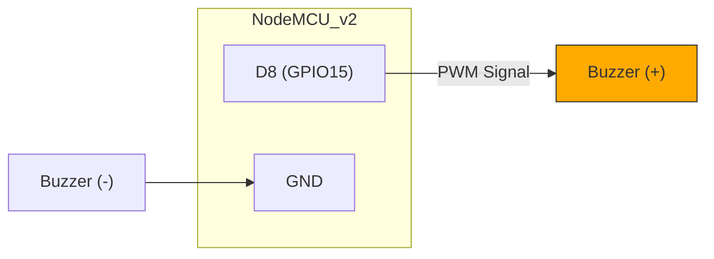

### Connections

| Buzzer Pin | Connect To    |
| ---------- | ------------- |
| + (positive)| D8 (GPIO15) |
| - (negative)| GND         |

### Code

```cpp
#include <Arduino.h>

#define BUZZER_PIN D8  // GPIO15

// Note frequencies (Hz)
#define NOTE_C4 262
#define NOTE_D4 294
#define NOTE_E4 330
#define NOTE_F4 349
#define NOTE_G4 392
#define NOTE_A4 440
#define NOTE_B4 494
#define NOTE_C5 523

int melody[] = {
  NOTE_C4, NOTE_D4, NOTE_E4, NOTE_F4,
  NOTE_G4, NOTE_A4, NOTE_B4, NOTE_C5
};
int noteDuration = 300;

void setup() {
  Serial.begin(115200);
}

void loop() {
  for (int i = 0; i < 8; i++) {
    tone(BUZZER_PIN, melody[i], noteDuration);
    delay(noteDuration + 50);
    noTone(BUZZER_PIN);
  }
  delay(2000);
}
```

---

## Full System Wiring Overview

Below is a combined diagram showing multiple components connected to a single NodeMCU v2 simultaneously:

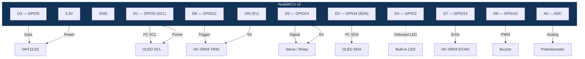

---

## Tips & Troubleshooting

| Issue | Solution |
| ----- | -------- |
| Upload fails | Hold **FLASH** button during upload, or check USB cable (use data cable, not charge-only) |
| `GPIO0` stuck LOW at boot | D3 is pulled LOW — board enters flash mode. Avoid using D3 for inputs that are LOW at boot |
| `GPIO15` must be LOW at boot | D8 is pulled LOW at boot. Connecting certain modules may prevent boot |
| `GPIO2` must be HIGH at boot | D4 is pulled HIGH at boot. Don't pull it LOW externally during reset |
| Analog reads seem wrong | NodeMCU has onboard voltage divider on A0 — input range is 0–3.3V on the pin, 0–1V at chip |
| Wi-Fi won't connect | Double-check SSID/password; ensure 2.4 GHz network (ESP8266 does not support 5 GHz) |
| Brownouts / random resets | Use an external power supply; USB may not supply enough current for motors/relays |
| I²C device not found | Run an I²C scanner sketch to verify address; check SDA/SCL wiring |

---

## Glossary

| Term | Definition |
| ---- | ---------- |
| **ADC (Analog-to-Digital Converter)** | Hardware that converts a continuous analog voltage into a discrete digital number. The ESP8266 has a single 10-bit ADC on pin A0 (0–1023). |
| **Anode** | The positive (+) terminal of a polarised component such as an LED or diode. On a standard LED it is the longer leg. |
| **Baud Rate** | The number of signal changes (symbols) per second on a serial line. Common values: 9600, 115200. Sets the speed for `Serial.begin()`. |
| **Breadboard** | A solderless prototyping board with internally connected rows of holes used to build temporary circuits. |
| **Buzzer** | An electromechanical or piezoelectric component that produces an audible tone when driven by an electrical signal. |
| **Cathode** | The negative (−) terminal of a polarised component such as an LED or diode. On a standard LED it is the shorter leg. |
| **COM (Common)** | The shared terminal on a relay that connects to either the NO or NC contact depending on the relay state. |
| **CPU Frequency** | The clock speed of the processor. The ESP8266 runs at 80 MHz by default and can be set to 160 MHz. |
| **Deep Sleep** | A low-power mode where the ESP8266 shuts down most circuitry and wakes via a signal on GPIO16 (D0) or a timer. |
| **DHT11 / DHT22** | Digital temperature and humidity sensors. DHT11 is lower cost/accuracy; DHT22 offers wider range and better precision. |
| **Digital I/O** | Input/output pins that operate in two states: HIGH (3.3 V on ESP8266) or LOW (0 V). |
| **Duty Cycle** | The percentage of one PWM period during which the signal is HIGH. 0 % = always off, 100 % = always on. |
| **ESP8266** | A low-cost Wi-Fi microcontroller SoC made by Espressif Systems, featuring a 32-bit Tensilica processor, Wi-Fi stack, and GPIO pins. |
| **Firmware** | The compiled program that is flashed onto a microcontroller and runs when it powers on. |
| **Flash Memory** | Non-volatile storage on the ESP8266 used to hold the firmware and file system (typically 4 MB on ESP-12E). |
| **Framework** | A software layer (e.g. Arduino, ESP-IDF) that provides libraries, APIs, and build tools for developing firmware. |
| **GND (Ground)** | The zero-volt reference point in a circuit. All components and power sources share a common ground. |
| **GPIO (General Purpose Input/Output)** | Microcontroller pins that can be configured in software as either digital inputs or outputs. |
| **HC-SR04** | An ultrasonic distance sensor that measures distance by timing the echo of a 40 kHz sound pulse. Range ≈ 2–400 cm. |
| **I²C (Inter-Integrated Circuit)** | A two-wire serial protocol (SDA + SCL) for communicating between a master and one or more slave devices at short distances. |
| **INPUT_PULLUP** | A pin mode that enables the microcontroller's internal pull-up resistor, keeping the pin HIGH when nothing is connected and reading LOW when shorted to GND. |
| **LED (Light Emitting Diode)** | A semiconductor component that emits light when forward-biased. Requires a current-limiting resistor in most circuits. |
| **Library (lib)** | A reusable package of code (header + source files) that provides functions for a specific peripheral or protocol (e.g. `DHT.h`, `Servo.h`). |
| **MISO (Master In Slave Out)** | The SPI data line that carries data from the slave device to the master. |
| **MOSI (Master Out Slave In)** | The SPI data line that carries data from the master to the slave device. |
| **NC (Normally Closed)** | A relay contact that is connected to COM when the relay is de-energised and disconnected when energised. |
| **NO (Normally Open)** | A relay contact that is disconnected from COM when the relay is de-energised and connected when energised. |
| **NodeMCU** | An open-source development board built around the ESP-12E module, providing USB-to-serial, a voltage regulator, and convenient pin headers. |
| **OHM (Ω)** | The SI unit of electrical resistance. Common resistor values in hobby electronics: 220 Ω, 1 kΩ, 4.7 kΩ, 10 kΩ. |
| **OLED (Organic Light Emitting Diode)** | A display technology where each pixel emits its own light. The SSD1306 is a common 128×64 OLED driver IC. |
| **OTA (Over-The-Air)** | Updating firmware wirelessly via Wi-Fi instead of a USB cable. |
| **PlatformIO** | An open-source ecosystem for embedded development that integrates with VS Code, providing build, upload, and library management. |
| **Potentiometer** | A three-terminal variable resistor. Turning the shaft moves a wiper along a resistive element, varying the output voltage. |
| **Pull-down Resistor** | A resistor connected between a pin and GND that holds the pin LOW when no other signal is applied. |
| **Pull-up Resistor** | A resistor connected between a pin and VCC that holds the pin HIGH when no other signal is applied. |
| **PWM (Pulse Width Modulation)** | A technique that simulates analog output by rapidly switching a digital pin on and off at a set duty cycle and frequency. |
| **Relay** | An electrically operated switch that uses an electromagnet to mechanically open or close a separate circuit, often for high-power loads. |
| **Resistor** | A passive component that limits current flow. Value measured in ohms (Ω). |
| **RSSI (Received Signal Strength Indicator)** | A measurement (in dBm) of the Wi-Fi signal power received by the ESP8266. Lower (more negative) values indicate weaker signals. |
| **RX / TX** | Receive / Transmit — the serial data lines. TX of one device connects to RX of the other and vice versa. |
| **SCLK (Serial Clock)** | The clock line in SPI communication, driven by the master to synchronise data transfer. |
| **SDA (Serial Data)** | The bidirectional data line in I²C communication. |
| **SCL (Serial Clock)** | The clock line in I²C communication, driven by the master. |
| **Serial Monitor** | A terminal window (in PlatformIO or Arduino IDE) that displays text sent over the USB-serial connection from the microcontroller. |
| **Servo Motor** | A motor with built-in feedback control that can be positioned to a specific angle (typically 0–180°) via a PWM signal. |
| **SoC (System on a Chip)** | A single integrated circuit that contains a processor, memory, peripherals, and (on the ESP8266) a Wi-Fi radio. |
| **SPI (Serial Peripheral Interface)** | A four-wire serial protocol (MOSI, MISO, SCLK, CS) for high-speed communication between a master and slave devices. |
| **SSD1306** | A common OLED display driver IC supporting 128×64 or 128×32 pixel resolutions over I²C or SPI. |
| **SSID (Service Set Identifier)** | The human-readable name of a Wi-Fi network. |
| **VCC** | The positive supply voltage pin on a component (e.g. 3.3 V or 5 V). |
| **VIN** | The input voltage pin on the NodeMCU, connected directly to the USB 5 V rail (bypasses the 3.3 V regulator). |
| **Voltage Divider** | A simple circuit of two resistors in series that produces an output voltage that is a fraction of the input voltage. Used to level-shift 5 V signals to 3.3 V. |
| **Volatile Memory (RAM)** | Memory that loses its contents when power is removed. The ESP8266 has ~80 KB of data RAM. |
| **Watchdog Timer (WDT)** | A hardware timer that resets the microcontroller if the firmware fails to periodically "feed" it, preventing lockups. Call `yield()` or `delay()` in long loops to avoid WDT resets on the ESP8266. |
| **Wi-Fi Station (STA)** | A mode where the ESP8266 connects to an existing Wi-Fi access point as a client. |
| **Wi-Fi Access Point (AP)** | A mode where the ESP8266 creates its own Wi-Fi network that other devices can connect to. |
| **Wire (library)** | The Arduino library that implements I²C master/slave communication. Included via `#include <Wire.h>`. |

---

*Last updated: 14 March 2026*
